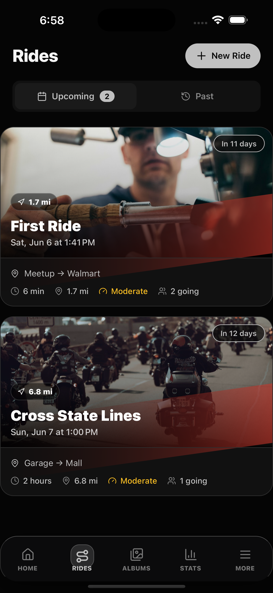
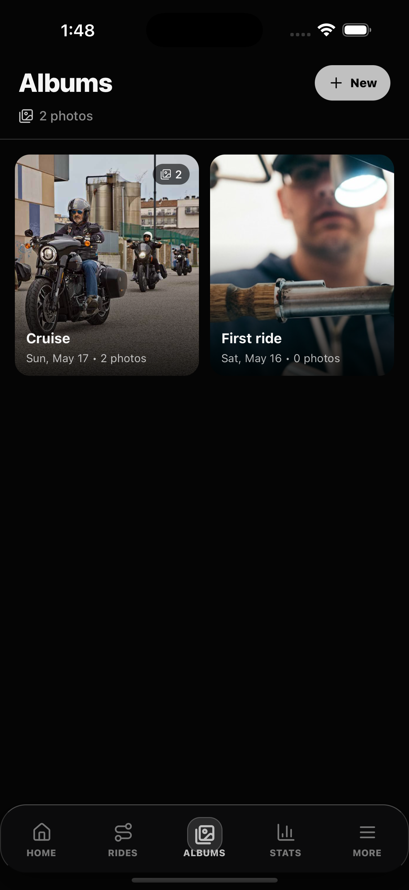
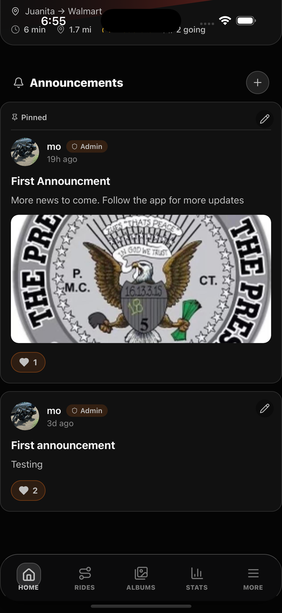

# PresidentsMC

PresidentsMC is a private motorcycle club app made for a local biker club based in New Haven, Connecticut, with chapters in other Connecticut cities.

The club wanted one place to coordinate rides, approve members, post announcements, share photos, and keep track of road memories without using a mix of group chats and social media.

## Screenshots

<p>
  
  
  
  
  
</p>

## What It Does

- Private club onboarding and member approval
- Ride planning with dates, meetups, distance, and attendees
- Club announcements with pinned updates
- Shared photo albums for rides and events
- Member profiles, admin roles, and club stats
- Optional club subscription support for paid features

## Open Source Notes

This repo is shared as a real app foundation that other clubs can learn from or adapt.

No production `.env` file, Firebase service account, App Store key, Google Play key, RevenueCat webhook secret, or other private credential should be committed here. If you use this for your own club, create your own Firebase, RevenueCat, Expo, Apple, and Google accounts.

Use `expo/.env.example` as the starting point for local configuration.

## Run Locally

Install dependencies and start the Expo app:

```bash
bun install --cwd expo
bun run start
```

The app lives in the `expo/` folder.

## Legal

- [Privacy Policy](https://sites.google.com/view/presidentsmc-privacy/home)
- [Terms of Use](https://sites.google.com/view/presidentsmc-terms/home)
