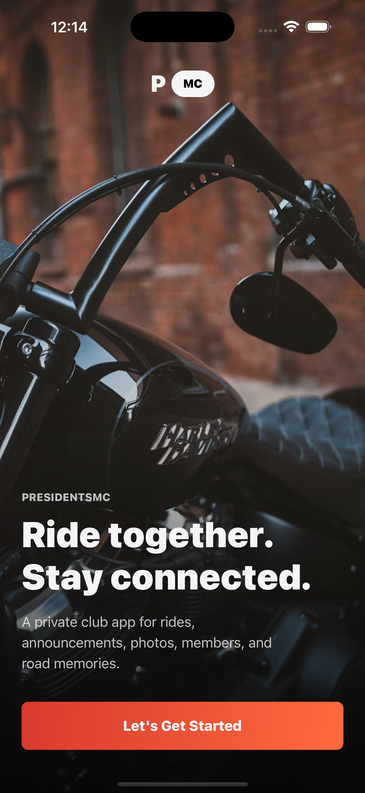
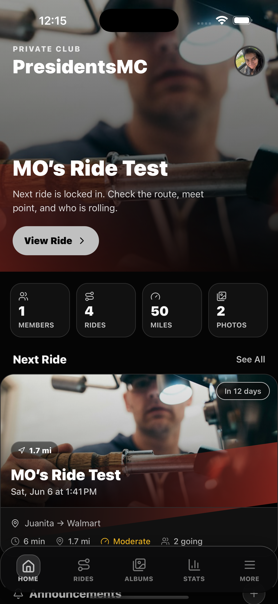

# PresidentsMC

PresidentsMC is a private motorcycle club app for rides, announcements, members, shared albums, club stats, and road memories.

This rebuild keeps the PresidentsMC product experience on the stable Crew native base: Expo SDK 54, React Native 0.81.5, and the new architecture enabled.

## Preview

<p>
  
  
</p>

## Stack

- Expo Router
- React Native 0.81.5
- Expo SDK 54
- Firebase Auth, Firestore, Storage, Functions
- RevenueCat for subscriptions
- EAS Build and TestFlight for iOS distribution

## Local Development

From the repo root:

```bash
bun run start
```

From the Expo app directly:

```bash
cd expo
bun run start
```

Additional checks:

```bash
bun run lint
bun x tsc --noEmit
bunx expo-doctor
```

## Firebase

This project uses the PresidentsMC Firebase project:

- Project ID: `presidentsmc-50010`
- Firestore rules: `firestore.rules`
- Storage rules: `storage.rules`
- Cloud Functions: `functions/src/index.ts`

Deploy from `expo/`:

```bash
firebase deploy --only functions --project presidentsmc-50010
firebase deploy --only firestore:indexes --project presidentsmc-50010
```

## Release

- App name: `PresidentsMC`
- iOS bundle ID: `app.mostudios.presidentsmc`
- Android package: `app.mostudios.presidentsmc`
- EAS project ID: `3fa3b774-aa73-4229-90a2-b834111adbf2`

Build for TestFlight:

```bash
eas secret:push --scope project --env-file .env
eas build --platform ios --profile production --clear-cache
eas submit --platform ios --latest
```

## RevenueCat

- Entitlement: `PresidentsMC Pro`
- Monthly product ID: `monthly`
  - Reference name: `PresidentsMC Monthly`
  - Duration: 1 month
  - Price: $3.99/month
- Yearly product ID: `yearly`
  - Reference name: `PresidentsMC Yearly`
  - Duration: 1 year
  - Price: $34.99/year

Create the matching subscriptions in App Store Connect and Google Play Console, then attach both products to the `PresidentsMC Pro` entitlement in RevenueCat. The product IDs above must match the app constants.

See [RevenueCat setup](./docs/revenuecat-setup.md) for the full store and dashboard checklist.

Required environment values:

```bash
EXPO_PUBLIC_REVENUECAT_IOS_API_KEY=...
EXPO_PUBLIC_REVENUECAT_ANDROID_API_KEY=...
EXPO_PUBLIC_REVENUECAT_TEST_API_KEY=...
```

Real purchases require a development build or TestFlight. Expo Go is only useful for basic UI/runtime checks.
